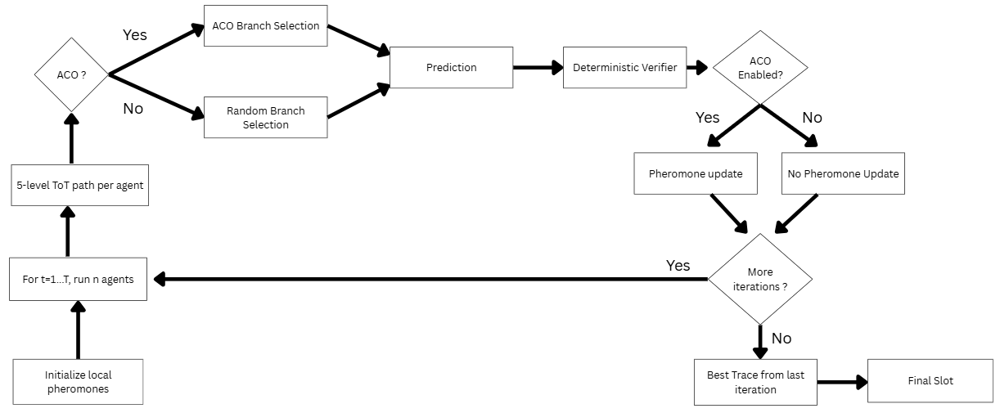
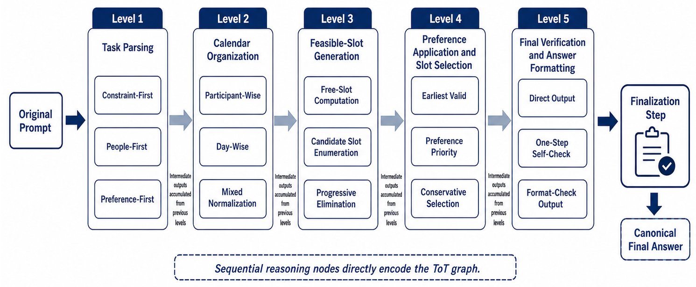

# Decentralized SLM Swarm Reasoning for Constrained Planning

[]()
[]()
[]()

## Paper

For the full academic write-up, see [Decentralized SLM Swarm Reasoning for Constrained Planning.pdf](./decentralized_slm_swarm_planning.pdf).

This repository contains the implementation, evaluation assets, and final paper for an academic study on decentralized reasoning for constrained planning with Small Language Model (SLM) agents.

## Overview

The scope of this project is exploratory and methodological. It investigates whether decentralized coordination principles from swarm intelligence can be combined with the semantic reasoning capabilities of Small Language Models (SLMs) to support collective problem solving in constrained planning tasks.

Rather than attempting to replace centralized LLM-based reasoning systems outright, the project studies an alternative system design in which multiple smaller reasoning agents cooperate through decentralized coordination. This framing is especially relevant for settings where robustness, distributed reasoning, interpretability of intermediate reasoning steps, and iterative solution improvement matter.

The target task is calendar scheduling under hard constraints such as participant availability, working hours, duration, and allowed days, with optional soft preferences such as earliest-slot selection.

The project combines:

- fixed-depth Tree-of-Thought (ToT) decomposition for structured reasoning;
- Ant Colony Optimization (ACO) for path selection over reasoning branches;
- a deterministic verifier for task-aware scoring and ranking of candidate solutions;
- multi-agent iterative search over a shared task-local pheromone state.

Conceptually, the system treats reasoning as a search problem over structured intermediate decisions rather than a single direct generation step.



## Research Question

The central research question is whether decentralized multi-agent SLM reasoning can improve constrained planning performance by combining:

- structured Tree-of-Thought decomposition for candidate-path exploration;
- swarm-intelligence mechanisms for coordination and solution refinement without central control;
- benchmark-based evaluation on a curated calendar scheduling subset of NaturalPlanner.

More specifically, the study asks how much of the observed performance gain comes from structured multi-agent reasoning itself, and how much additional value is contributed by pheromone-guided adaptation through ACO.

## Tech Stack

| Component | Technology |
|---|---|
| Language | Python |
| Agent Framework | LangGraph |
| LLM Orchestration | LangChain |
| Model Client | `langchain-openai` |
| Model Backends | OpenAI-compatible APIs / OpenRouter / local compatible endpoints |
| Data Format | JSON / JSONL |
| Evaluation | Deterministic task-specific verifier and solve-rate evaluation |

## Method

### Problem Formulation

Given a scheduling task, the system must output a meeting slot of the form:

```text
Monday, 10:30 - 11:00
```

The proposed slot is valid only if it satisfies all hard constraints:

- all participants are available;
- the duration is correct;
- the slot lies within working hours;
- the day belongs to the allowed planning horizon;
- any hard preference constraints are respected.

Soft preferences are then used to differentiate among multiple valid solutions.

### Five-Level Tree-of-Thought

Each agent traverses a fixed five-stage reasoning graph:

1. Parse the task.
2. Organize calendars.
3. Generate feasible availability.
4. Apply preferences / selection policy.
5. Produce the final answer and verify formatting.

Each stage contains multiple branch options, for example `constraint_first`, `day_wise`, `free_slot_computation`, or `earliest_valid`. Different agents explore different branch combinations, which creates path diversity across the swarm.



### ACO-Guided Branch Selection

At each ToT level, the agent must choose one branch. When `aco=true`, branch selection is not uniform. Instead, the framework samples from an ACO probability distribution that combines learned pheromone strength with a hand-designed heuristic prior.


Where:

- `tau_ij` is the pheromone value associated with branch `j` at level `i`;
- `eta_ij` is the heuristic desirability of that branch for the current task;
- `alpha` determines how strongly historical pheromone affects selection;
- `beta` determines how strongly the heuristic prior affects selection;
- `epsilon` is a smoothing constant that avoids degenerate zero-probability paths.

This design lets the system balance two signals:

- exploit branches that have produced strong traces earlier in the same task;
- explore branches that are heuristically plausible for the task structure.

If `aco=false`, the same reasoning tree is traversed under the same search budget, but branch selection becomes uniform random sampling instead of pheromone-guided sampling.

### Pheromone Update

After each iteration, pheromones are updated for the current task only. Better-scoring reasoning traces deposit more pheromone on the branch edges they used, while evaporation prevents early choices from dominating indefinitely.


with:


This gives the swarm a task-local memory: higher-scoring reasoning traces increase the probability that similar paths are revisited later in the same task.

Interpretation:

- `rho` is the evaporation rate, which reduces stale path influence;
- `Q_k` is the quality score of agent `k`;
- `Delta_ij^(k)` is non-zero only if agent `k` traversed edge `(i, j)`.

In `solve` mode, pheromone state is local to a single task. It is initialized fresh, refined across iterations, and discarded before the next task. This keeps cross-task leakage out of the evaluation and makes ACO vs non-ACO comparisons cleaner.

### Deterministic Verifier

Candidate answers are not scored by another model. They are scored by a deterministic task-quality module that parses the task, validates the candidate slot, measures soft-preference satisfaction, and produces a bounded score in `[0, 1]`.

The scoring rule is intentionally banded:

- hard-valid candidates are mapped to the range `0.5` to `1.0`, depending on soft-preference satisfaction;
- hard-invalid candidates are mapped to the range `0.0` to `0.49`, based on the fraction of hard checks passed.

This enforces a strict separation between valid and invalid schedules and allows the system to rank candidates reliably during search. In practice, even a partially correct invalid answer cannot outrank a fully valid one.

### End-to-End Workflow

For each scheduling task:

1. Extract the current task prompt and derive lightweight task features.
2. Initialize a fresh task-local pheromone table.
3. Run `n` agents for `T` iterations through the fixed ToT graph.
4. Score each candidate with the deterministic verifier.
5. Update pheromones if ACO is enabled.
6. Return the best trace from the final iteration as the final prediction.

The implementation therefore combines symbolic validation, probabilistic path selection, and language-model reasoning in a single loop.

## Dataset

The experiments use the calendar scheduling subset of the NaturalPlanner benchmark. In the original benchmark, this subset contains `1,000` instances distributed evenly across `10` categories:

- `2-person` scheduling over `1` to `5` candidate days;
- `3-, 4-, 5-, 6-, and 7-person` scheduling tasks, each defined over `1` day.

For this study, the evaluation used a curated subset of `400` instances, constructed by taking the first `40` samples from each category. This preserves variation in both participant count and planning horizon while keeping the experimental cost manageable.

The dataset is JSON-based and each item includes both generation-time and evaluation-time fields. The most relevant fields from Table 1 of the paper are:

| Field | Purpose |
|---|---|
| `num_people` | Number of participants who must attend the meeting |
| `num_days` | Number of valid candidate days |
| `duration` | Required meeting duration |
| `prompt_5shot` | Few-shot prompt with solved examples plus the active task |
| `golden_plan` | Ground-truth reference solution |
| `prompt_0shot` | Zero-shot version of the active task for task-specific evaluation |
| `pred_5shot_pro` | Prediction field retained from the original benchmark structure |
| `pred_model` | Model identifier associated with the stored prediction metadata |

## Experimental Setup

- Benchmark: NaturalPlanner calendar scheduling subset, evaluated here on a curated 400-task split.
- Comparative settings:
  - single SLM baseline;
  - multi-agent ToT without ACO;
  - multi-agent ToT with ACO.
- Repository focus: `solve` mode in `swarm-calendar-planning-final/Aco-ToT-multi-agent-framework/infer_aco_tot_calendar.py`.
- Current implementation stack: Python, LangGraph, LangChain OpenAI-compatible clients, task-specific scoring, and JSONL run logging.

The framework is backend-flexible: it can run against OpenRouter, OpenAI-compatible endpoints, or local compatible servers, depending on `LLM_BASE_URL` and API key configuration.

## Results and Findings

### Overall Solve Rate

| Configuration | Solve Rate |
|---|---:|
| Single SLM baseline | 0.2475 |
| Multi-agent ToT without ACO | 0.3950 |
| Multi-agent ToT with ACO | 0.4000 |

Key takeaways from Sections 6.1 to 6.6 of the paper:

- The full ToT+ACO system achieved the best overall performance: `0.4000`.
- Relative to the single-agent baseline, this is an absolute improvement of `15.25` percentage points.
- Most of the gain came from structured multi-agent ToT reasoning itself: `0.2475 -> 0.3950`.
- The incremental ACO gain over ToT-only was positive but small in the current setup: `0.3950 -> 0.4000`.

### Category-Level Behavior

Category analysis shows that the decentralized search process is especially useful when multiple participant constraints must be jointly satisfied within a narrow horizon.

Representative examples from the paper:

- `3 people, 1 day`: `0.250 -> 0.550 -> 0.575`
- `5 people, 1 day`: `0.175 -> 0.300 -> 0.525`
- `6 people, 1 day`: `0.325 -> 0.525 -> 0.525`

Interpretation:

- ToT consistently improves robustness over direct one-shot generation.
- The strongest effect appears in higher-constraint one-day scheduling tasks.
- ACO helps in some categories, but the effect is not yet uniformly stable across all task types.

### Interpretation of the Findings

- The main empirical contribution is not merely "using more agents"; it is converting planning into structured multi-path reasoning with explicit intermediate states.
- The deterministic verifier is critical because it turns open-ended model outputs into comparable search candidates.
- ACO is methodologically meaningful because it adds reinforcement, local adaptation, and collective memory to reasoning search.
- The present evidence supports the value of decentralized ToT reasoning strongly, while the independent ACO contribution remains promising rather than conclusively established.

### Current Limitations

- Results are based on a curated 400-task subset rather than the full benchmark.
- Category-level comparisons use only 40 tasks per category.
- The main reported results appear to come from single runs rather than repeated multi-seed studies.
- The current search budget and reasoning-tree width may be too small for pheromone effects to fully emerge.
- Solve rate is strict and useful, but it does not fully expose failure modes such as parsing error, preference violation, or format mismatch.

## Conclusion

This project provides initial empirical evidence that decentralized SLM-based agents can solve constrained planning tasks more effectively than a single-agent baseline when reasoning is decomposed into structured search stages.

The clearest conclusion is that multi-agent Tree-of-Thought reasoning substantially improves calendar scheduling performance by reducing the fragility of one-shot generation. Ant Colony Optimization further improves the best observed result and introduces a principled swarm-intelligence mechanism for adaptive reasoning-path selection, but its standalone empirical effect requires larger-scale validation.

From an AI engineering perspective, the project demonstrates an end-to-end research workflow: problem formalization, agentic system design, algorithmic adaptation, deterministic evaluation, category-wise analysis, and explicit acknowledgment of experimental limits.

## Repository Map

```text
swarm-calendar-planning-final/
|- Aco-ToT-multi-agent-framework/
|  |- infer_aco_tot_calendar.py
|  |- aco_tot/
|  |  |- engine.py
|  |  |- llm_nodes.py
|  |  |- aco.py
|  |  |- heuristics.py
|  |  |- pheromone.py
|  |  |- task_quality.py
|  |  |- prompt_io.py
|  |  |- run_logging.py
|  |  `- types.py
|  `- tests/
|- data/
|- evaluation_script/
`- paper/
```

Core files:

- `aco_tot/engine.py`: orchestration of per-task multi-agent search and scoring.
- `aco_tot/llm_nodes.py`: LangGraph-based reasoning nodes and model invocation flow.
- `aco_tot/aco.py`, `heuristics.py`, `pheromone.py`: ACO probability computation and updates.
- `aco_tot/task_quality.py`: deterministic verifier for hard/soft constraint scoring.
- `evaluation_script/evaluate_calendar_scheduling.py`: solve-rate evaluation against gold labels.

## Running the Framework

From `swarm-calendar-planning-final/Aco-ToT-multi-agent-framework`:

```bash
python infer_aco_tot_calendar.py --mode solve --data_path ../data/calendar_scheduling_input_curated.json --out_path ../data/calendar_scheduling_output_curated.json --model google/gemma-3-4b-it --agents_per_task 8 --iterations_per_task 6 --alpha 1.0 --beta 2.0 --epsilon 0.001 --rho 0.1 --seed 42 --aco true
```

Minimal environment requirements:

- Python environment with project dependencies installed;
- `OPENROUTER_API_KEY` or `OPENAI_API_KEY` if using a hosted backend;
- optional `LLM_BASE_URL` for a local or alternate OpenAI-compatible endpoint.

## Why This Project Matters

This repository is not only a scheduling system. It is a compact research prototype for agentic planning under constraints, showing how LLM/SLM reasoning can be combined with:

- decentralized multi-agent execution,
- search over reasoning paths,
- swarm-inspired coordination,
- symbolic validation,
- and benchmark-driven empirical analysis.

That combination is the main technical contribution of the project.
